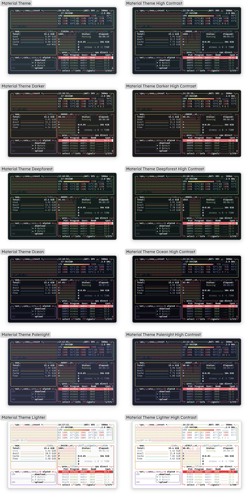

# Material Theme BTOP

Material [BTOP](https://github.com/aristocratos/btop) theme ported from VS Code [Material Theme](https://github.com/material-theme/vsc-material-theme)

## ⚙️ Installation

1. Run `git clone https://github.com/moktavizen/material-blackbox.git`
2. Copy your preferred variant from the `src` folder to `~/.config/btop/themes/`
3. Restart BTOP and select the theme.

## 🎨 Variants

> [!NOTE]
> High Contrast variants provide background with more contrast.
