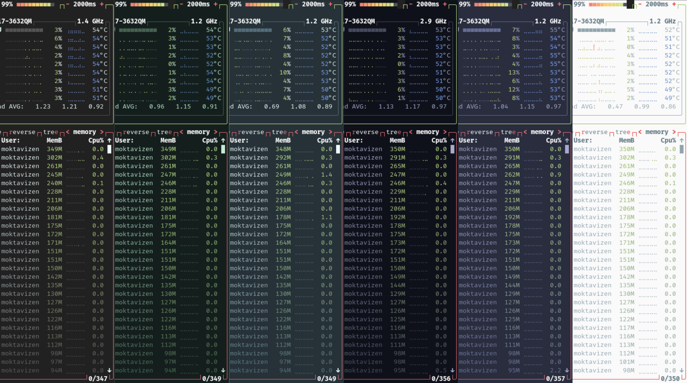
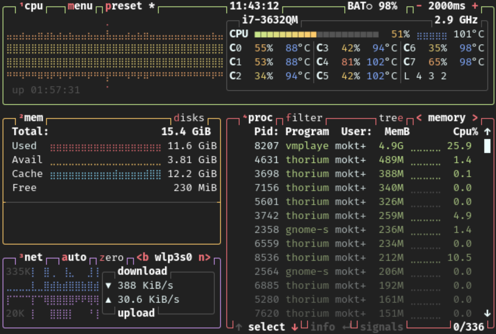
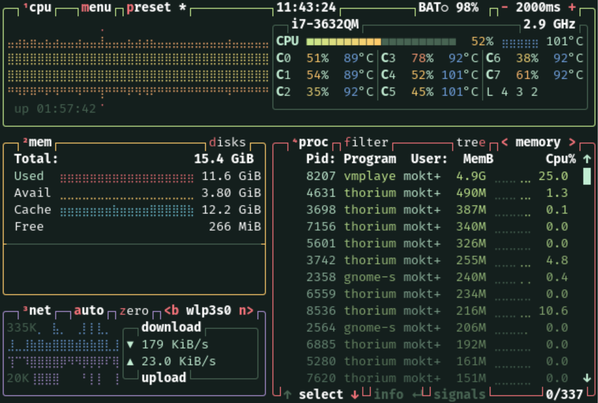
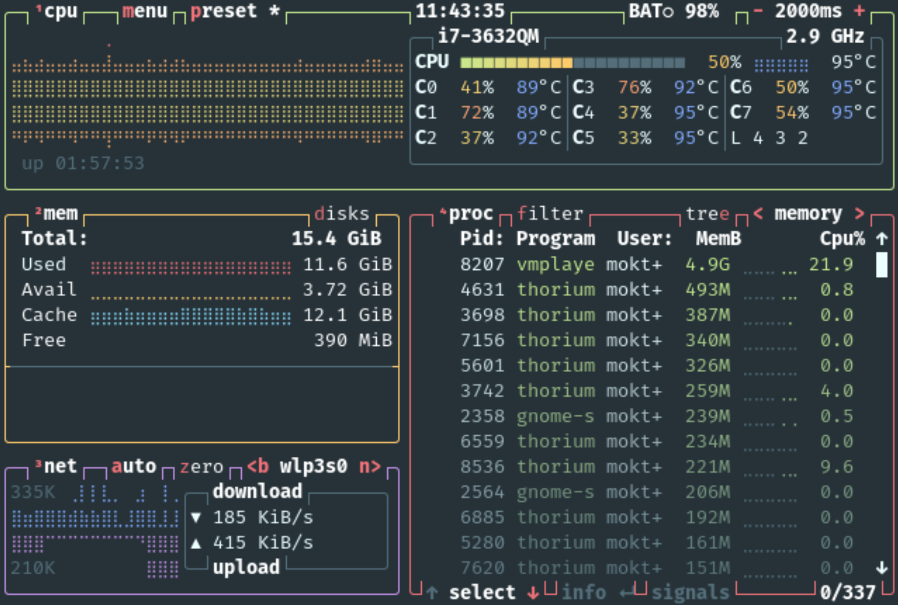
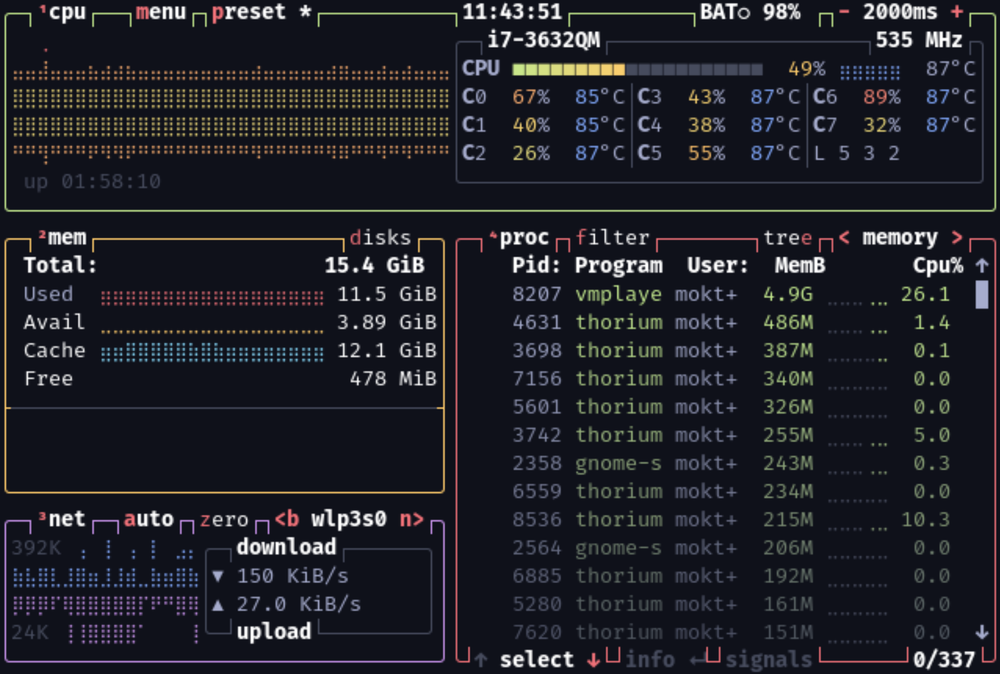
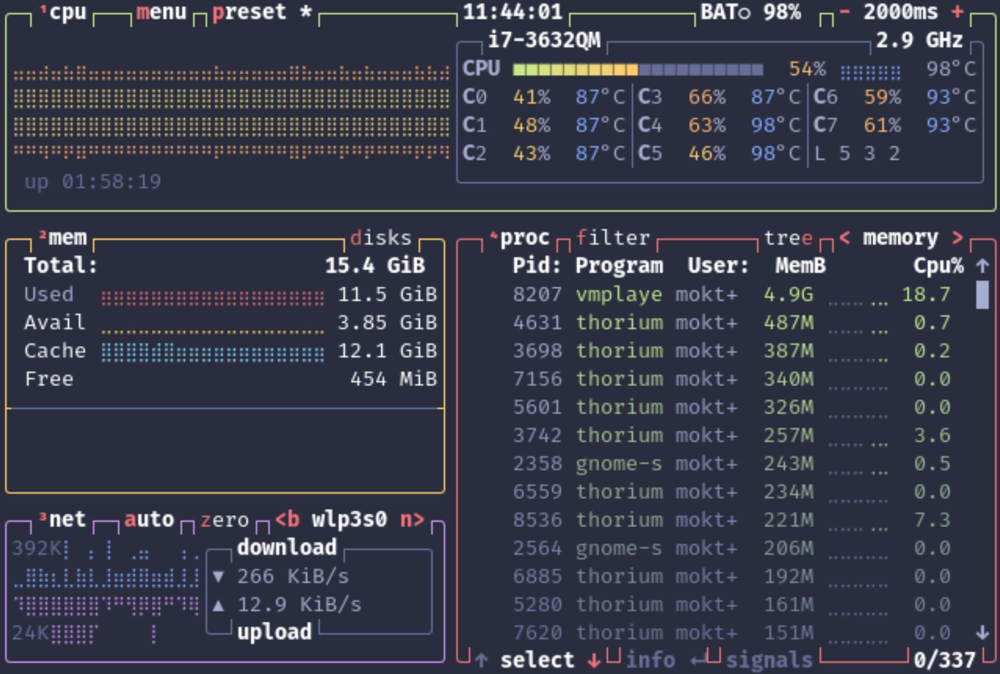
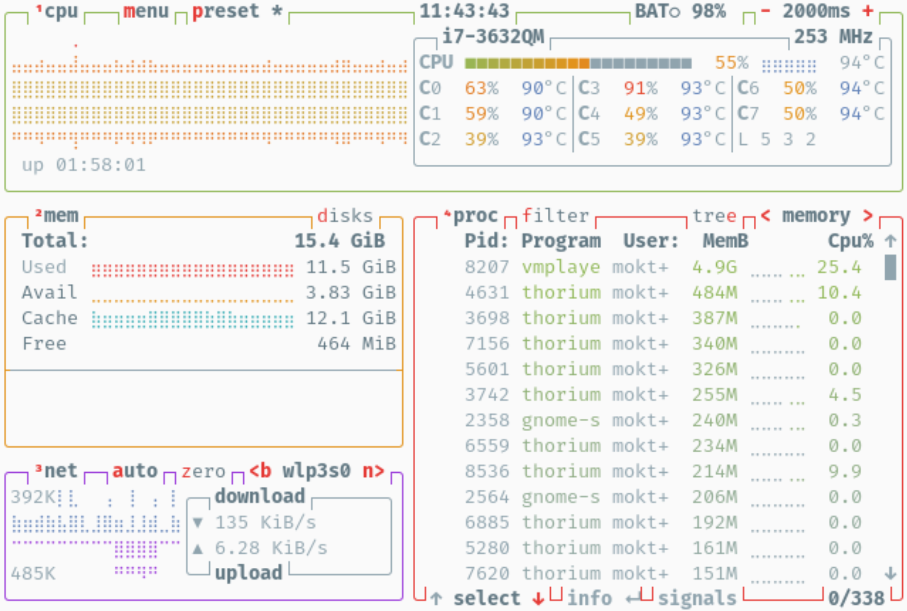

# Material Theme BTOP
Material [BTOP](https://github.com/aristocratos/btop) theme ported from https://github.com/material-theme/vsc-material-theme



Themes from left to right:

<details>
    <summary>Material Darker</summary>
    
</details>

<details>
    <summary>Material Deepforest</summary>
    
</details>

<details>
    <summary>Material Default</summary>
    
</details>

<details>
    <summary>Material Ocean</summary>
    
</details>

<details>
    <summary>Material Palenight</summary>
    
</details>

<details>
    <summary>Material Lighter</summary>
    
</details>

High Contrast variant provides background with more contrast.

## Installation

### 1. Clone this repository

```bash
git clone https://github.com/moktavizen/material-btop.git
```

### 2. Copy the themes into `~/.config/btop/themes/`

```bash
cp ./material-btop/material* ~/.config/btop/themes/
```

### 3. Remove the repository

```bash
rm -rf ./material-btop/
```

### 4. Restart BTOP

## License
[MIT License](./LICENSE)
